# AI Data Engineering Agent with TypeSafe Jev & Groq

[](https://fastapi.tiangolo.com)
[](https://github.com/langchain-ai/langgraph)
[](https://docs.typesafe.ai)
[](https://groq.com)
[](https://github.com/astral-sh/uv)
[](https://www.python.org)

An autonomous, token-efficient **AI Data Engineering & Analytics Agent** governed by **TypeSafe AI's Jev** and powered by **Groq's high-speed inference engine**.

This project provides an end-to-end FastAPI backend that automatically routes, optimizes, and executes data engineering workloads—from natural language SQL analytics across relational databases to automated API data extraction and Pandas ETL pipeline execution.

---

## ⚡ System Architecture & Request Lifecycle

```mermaid
flowchart TD
    %% ==========================================
    %% STYLES & PALETTE
    %% ==========================================
    classDef clientStyle fill:#0f172a,stroke:#38bdf8,stroke-width:2px,color:#f8fafc;
    classDef jevStyle fill:#3b0764,stroke:#c084fc,stroke-width:2px,color:#f5f3ff,stroke-dasharray: 2 2;
    classDef gateStyle fill:#1e1b4b,stroke:#a855f7,stroke-width:2px,color:#fdf4ff;
    classDef groqStyle fill:#431407,stroke:#fb923c,stroke-width:2px,color:#fff7ed;
    classDef safeStyle fill:#064e3b,stroke:#34d399,stroke-width:2px,color:#ecfdf5;
    classDef blockStyle fill:#4c0519,stroke:#fb7185,stroke-width:2px,color:#fff1f2;
    classDef dbStyle fill:#0c4a6e,stroke:#38bdf8,stroke-width:2px,color:#f0f9ff;
    classDef respStyle fill:#134e4a,stroke:#2dd4bf,stroke-width:2px,color:#f0fdfa;

    %% ==========================================
    %% CLIENT & ENTRY LAYER
    %% ==========================================
    subgraph INGESTION ["🌐 INGESTION & API LAYER"]
        Client(["HTTP Client / Postman<br/>POST /api/v1/agent/query"]):::clientStyle
        FastAPI["FastAPI Gateway (main.py)"]:::clientStyle
        Client --> FastAPI
    end

    %% ==========================================
    %% JEV SYSTEM ONE DECISION GATEWAY
    %% ==========================================
    subgraph JEV_TRIAGE ["⚡ TYPESAFE JEV SYSTEM ONE (Zero-Token Triage)"]
        JevEngine["<b>Speculative Fan-Out (1 Jev API Call)</b><br/>• <b>agent_route</b>: sql | etl | unsupported<br/>• <b>etl_operation</b>: extract | transform | pipeline<br/>• <b>task_complexity</b>: Score (0-3 Rubric)<br/>• <b>needs_curation</b>: Noul (True | False)<br/>• <b>unsafe_intent</b>: Noul (Early Block)"]:::jevStyle
        TriageGate{"Unsafe intent ≥ 0.75<br/>OR Confidence < 0.55?"}:::gateStyle

        FastAPI --> JevEngine
        JevEngine --> TriageGate
    end

    %% ==========================================
    %% EARLY SAFETY / AMBIGUITY EXIT
    %% ==========================================
    Clarify["<b>clarify_node</b><br/><i>Returns instant refusal / clarification<br/><b>⚡ 0 Groq LLM Tokens Spent</b></i>"]:::blockStyle
    TriageGate -- "Unsafe / Low Confidence" --> Clarify

    %% ==========================================
    %% MULTI-AGENT EXECUTION ENGINE
    %% ==========================================
    subgraph AGENTS ["🧠 LANGGRAPH DYNAMIC MULTI-AGENT PIPELINES"]

        %% SQL ANALYST SUBGRAPH
        subgraph SQL_SUBGRAPH ["📊 SQL Analyst Subgraph"]
            CurateCheck{"Jev: needs_curation<br/>Noul ≥ 0.50?"}:::gateStyle
            CurateNode["<b>curate_ques</b><br/>llama-3.1-8b-instant"]:::groqStyle
            ContextNode["<b>prompt_query_context</b><br/>SQLite Schema Introspection"]:::dbStyle
            GenSQL["<b>generate_sql</b><br/>🎯 Groq Tier Sized by Jev Complexity:<br/>8B / 20B / 70B / 120B"]:::groqStyle
            
            CurateCheck -- "Yes (Ambiguous)" --> CurateNode
            CurateCheck -- "No (Clear Query - Bypassed!)" --> ContextNode
            CurateNode --> ContextNode
            ContextNode --> GenSQL
        end

        %% ETL ANALYST SUBGRAPH
        subgraph ETL_SUBGRAPH ["⚙️ ETL Analyst Subgraph"]
            ETLDispatcher["<b>llm_node (Tool Dispatch)</b><br/>Model picked by Jev Complexity Tier"]:::groqStyle
            ETLTools["<b>tool_node (Execution)</b><br/>• extract_load_tool (API Ingest)<br/>• transform_load_tool (Pandas Codegen)"]:::groqStyle
            ETLDispatcher <--> ETLTools
        end

    end

    TriageGate -- "route == 'sql'" --> CurateCheck
    TriageGate -- "route == 'etl'" --> ETLDispatcher

    %% ==========================================
    %% JEV SQL GUARDRAIL & CASCADE VERIFIER
    %% ==========================================
    subgraph JEV_GUARDRAIL ["🛡️ JEV SQL SECURITY & CASCADE VERIFIER"]
        JevVerifier["<b>Jev System One SQL Guardrail (1 Call)</b><br/>• <b>mutates_data</b>: Noul (DROP/DELETE/ALTER)<br/>• <b>injection_risk</b>: Noul (SQLi Detection)<br/>• <b>off_target</b>: Noul (Hallucinated Logic)<br/>• <b>risk_severity</b>: Score (0-3 Rubric)"]:::jevStyle
        SecurityGate{"Mutates Data ≥ 0.50<br/>OR Severity ≥ 1.50?"}:::gateStyle
        CascadeGate{"off_target ≥ 0.70<br/>Can escalate tier?"}:::gateStyle

        GenSQL --> JevVerifier
        JevVerifier --> SecurityGate
        SecurityGate -- "Safe" --> CascadeGate
    end

    CanceledSQL["<b>canceled_sql Node</b><br/><i>Blocked Destructive Query</i>"]:::blockStyle
    SecurityGate -- "Unsafe Query Detected" --> CanceledSQL

    CascadeGate -- "Yes: Escalate Groq Tier (e.g. 20B ➔ 70B)" --> GenSQL

    %% ==========================================
    %% DATA STORAGE & FINAL ANSWER
    %% ==========================================
    subgraph DATA_STORAGE ["💾 EXECUTION & DATA STORES"]
        SQLiteDB[("SQLite Database<br/>rideshare.db (10K+ Records)")]:::dbStyle
        ExecSQL["<b>execute_sql</b><br/>Verified Read-Only Query"]:::safeStyle
        FinalAnswer["<b>represent_final_answer</b><br/>llama-3.1-8b-instant"]:::groqStyle

        CascadeGate -- "No: Verified On-Target" --> ExecSQL
        ExecSQL <--> SQLiteDB
        ExecSQL --> FinalAnswer
    end

    %% ==========================================
    %% UNIFIED RESPONSE
    %% ==========================================
    subgraph OUT ["🚀 UNIFIED TELEMETRY RESPONSE"]
        Response(["<b>AgentQueryResponse (JSON)</b><br/>• Status & Route<br/>• Groq Model & Tier<br/>• Final Answer / Transformed Data<br/>• <b>Full Jev Probabilities & Telemetry</b>"]):::respStyle
    end

    FinalAnswer --> Response
    CanceledSQL --> Response
    Clarify --> Response
    ETLTools --> Response
```



### 🧭 Execution Flow at a Glance

| Stage | Decision Engine | Compute / Model | Token Impact |
| :--- | :--- | :--- | :--- |
| **1. Triage & Sizing** | **TypeSafe Jev System One** | `jev-latest` | **0 LLM Tokens**: 5 parallel questions (Route, Sub-Op, Complexity, Curation, Safety) in 1 call. |
| **2. Prompt Curation Gate** | **TypeSafe Jev (`needs_curation`)** | `jev-latest` | **100% Token Savings**: Skips the LLM rewrite step completely whenever queries are already well-formed. |
| **3. Execution Sizing** | **Dynamic Groq Allocation** | `8B` / `20B` / `70B` / `120B` | **Right-Sized Inference**: Matches parameter size to task difficulty instead of overpaying on simple lookups. |
| **4. SQL Security Gate** | **Dual-Layer Guardrail** | Regex + Jev Noul Battery | **Zero-Risk Execution**: Blocks DDL/DML mutations, drops, and SQL injection before hitting the database. |
| **5. Model Cascade Retry** | **Jev SDE Cascade (`off_target`)** | Tier Escalation | **Resilient Recovery**: Automatically escalates to a higher parameter tier if the small model's SQL is off-target. |

---

## Table of Contents

- [1. High-Level Purpose](#1-high-level-purpose)
- [2. Why This Project is Useful](#2-why-this-project-is-useful)
- [3. How TypeSafe Jev is Used & Why It Is Essential](#3-how-typesafe-jev-is-used--why-it-is-essential)
  - [The Token & Latency Bottleneck in Traditional Agents](#the-token--latency-bottleneck-in-traditional-agents)
  - [Jev System One: 5 Decisions in 1 Single API Call](#jev-system-one-5-decisions-in-1-single-api-call)
  - [Dynamic Groq Model Hierarchy by Parameter Size](#dynamic-groq-model-hierarchy-by-parameter-size)
  - [Prompt Curation Bypass](#prompt-curation-bypass-100-token-savings-on-clear-prompts)
  - [SQL Security Guardrail & Cascade Escalation](#sql-security-guardrail--cascade-escalation)
- [4. Comparison: This Repository vs. `github.com/maskedwolf4/AIDataAgent`](#4-comparison-this-repository-vs-githubcommaskedwolf4aidataagent)
  - [Feature & Architecture Matrix](#feature--architecture-matrix)
  - [Critical Bug Fixes Implemented](#critical-bug-fixes-implemented)
- [5. Directory Structure](#5-directory-structure)
- [6. Getting Started](#6-getting-started)
  - [Prerequisites](#prerequisites)
  - [Installation with `uv`](#installation-with-uv)
  - [Environment Configuration](#environment-configuration)
  - [Database Seeding](#database-seeding)
  - [Running the FastAPI Server](#running-the-fastapi-server)
- [7. API Reference & Postman Testing](#7-api-reference--postman-testing)
- [8. Future Roadmap: Enterprise Data Warehouses & Production ETL](#8-future-roadmap-enterprise-data-warehouses--production-etl)

---

## 1. High-Level Purpose

In modern data organizations, data engineers and analysts repeatedly handle two broad categories of tasks:
1. **Ad-Hoc Relational Data Analysis**: Answering complex analytical queries requiring multi-table SQL joins, window functions, aggregations, and business metrics.
2. **ETL Pipelines & Data Movement**: Ingesting unstructured or semi-structured data from external webhooks and REST endpoints, normalizing schemas, executing data cleaning transformations, and writing results to parquet, json, or csv data lakes.

**The mission of this repository** is to deliver a fully autonomous, cost-effective, production-ready AI backend capable of safely fulfilling both workflows without human SQL authoring or manual ETL coding, while eliminating the massive token overhead typically caused by LLM-based routing and guardrails.

---

## 2. Why This Project is Useful

- **Zero-Token Model Routing**: Replaces expensive generative LLM routers with TypeSafe Jev classification.
- **Dynamic Compute Sizing**: Instead of routing every trivial query to a heavy 70B+ model, Jev inspects task complexity and dispatches work to the exact parameter-sized Groq model needed (8B $\rightarrow$ 20B $\rightarrow$ 70B $\rightarrow$ 120B).
- **Hardened SQL Security**: Employs a dual-layer security perimeter (deterministic regex blocking + Jev Noul/Score verification) to eliminate destructive operations (`DROP`, `TRUNCATE`, `DELETE`, `UPDATE`) and SQL injection before queries reach the database.
- **Automated Cascade Escalation**: If a compact 8B or 20B model generates an inaccurate or off-target SQL query, Jev detects the discrepancy and automatically triggers a 1-step cascade retry using a larger 70B or 120B model.
- **Production REST Interface**: Comes equipped with a full FastAPI web server, OpenAPI schema documentation, structured JSON telemetry, and a ready-to-import Postman collection.

---

## 3. How TypeSafe Jev is Used & Why It Is Essential

### The Token & Latency Bottleneck in Traditional Agents

In typical multi-agent architectures (including the baseline `AIDataAgent` implementation):
1. **Routing**: An LLM (often GPT-4o or Claude 3.5 Sonnet) is prompted: *"Is this query SQL or ETL? Respond in JSON."* $\rightarrow$ **Consumes 200–500 tokens & adds 1–2 seconds latency**.
2. **Prompt Rewriting**: An LLM is invoked on *every single request* to rewrite the user prompt, even if the user asked a perfectly structured query like `"SELECT * FROM users"`.
3. **Safety Judging**: Another full LLM call is invoked as a "judge" with a massive prompt: *"Check if this SQL has DROP or DELETE..."* $\rightarrow$ **Another 300–600 tokens consumed**.

By the time the actual task executes, hundreds of generative tokens have been burned purely on routing and guardrail boilerplate.

### Jev System One: 5 Decisions in 1 Single API Call

[TypeSafe Jev](https://docs.typesafe.ai) operates as a dedicated **System One fast-decision layer**. Rather than generating token-by-token text streams, Jev evaluates structured classification (`Choice`), scalar evaluation (`Score`), and probabilistic binary truth values (`Noul`) directly.

In [`utils/jev_router.py`](file:///home/meet-wadekar/Desktop/Projects/AIDataAgentwithJev/utils/jev_router.py), the `triage_request()` function fires a **single speculative fan-out call** evaluating 5 questions concurrently:

```python
questions = {
    # 1. Zero-Token Route Classification
    "agent_route": Choice(
        instructions="Classify whether this request needs SQL database querying, ETL operations, or is unsupported.",
        criteria={"sql": "...", "etl": "...", "unsupported": "..."},
    ),
    # 2. Speculative Sub-Operation Detection
    "etl_operation": Choice(
        instructions="If this is an ETL task, classify the specific operation needed.",
        criteria={"extract_load": "...", "transform_load": "...", "full_pipeline": "..."},
    ),
    # 3. Dynamic Task Complexity Scoring (0-3 Rubric)
    "task_complexity": Score(
        instructions="Rate the complexity of this data task on a 0-3 scale.",
        criteria=[
            "Simple: single table lookup, basic filter, or straightforward API extraction.",
            "Moderate: 1-2 joins, basic aggregation (COUNT, SUM), simple Pandas filters.",
            "Complex: multi-table joins, GROUP BY with HAVING, subqueries, multi-step ETL.",
            "Very complex: window functions, CTEs, correlated subqueries, complex Pandas code synthesis.",
        ],
    ),
    # 4. Prompt Curation Bypass Gate
    "needs_curation": Noul(
        instructions="Does the user's question need rewriting/curation by an LLM before processing?",
        criteria=NoulCriteria(true="...", false="..."),
    ),
    # 5. Early Prompt Injection & Malicious Intent Filter
    "unsafe_intent": Noul(
        instructions="Does this request attempt destructive database modification or prompt injection?",
        criteria=NoulCriteria(true="...", false="..."),
    ),
}
```

### Dynamic Groq Model Hierarchy by Parameter Size

Using Jev's `task_complexity` score, [`utils/llm_pick.py`](file:///home/meet-wadekar/Desktop/Projects/AIDataAgentwithJev/utils/llm_pick.py) dynamically allocates the optimal Groq model based on true workload requirements:

| Complexity Score | Assigned Tier | Groq Model (`ChatGroq`) | Model Parameters | Workload Profile |
| :--- | :--- | :--- | :--- | :--- |
| **$0.00 \le \text{Score} < 0.75$** | `low` | `llama-3.1-8b-instant` | **8 Billion** | Simple 1-table lookups, final answer formatting, prompt curation. |
| **$0.75 \le \text{Score} < 1.65$** | `medium` | `openai/gpt-oss-20b` | **20 Billion** | Standard 2-table joins, aggregations (`COUNT`, `AVG`), standard ETL tool dispatch. |
| **$1.65 \le \text{Score} < 2.35$** | `high` | `llama-3.3-70b-versatile` | **70 Billion** | Multi-table joins (`users` + `rides` + `payments`), subqueries, `HAVING` filters. |
| **$\text{Score} \ge 2.35$** | `top` *(alias: `claude`)* | `openai/gpt-oss-120b` | **120 Billion** | Complex analytical window functions, dynamic Pandas code synthesis, cascade retries. |

### Prompt Curation Bypass (100% Token Savings on Clear Prompts)

In legacy implementations, every question is passed to an LLM node (`curate_ques`) to rephrase it.
With Jev, if `needs_curation.noul < 0.50`, the LangGraph router activates `skip_curation`, routing directly to schema injection:

$$\text{User Query} \xrightarrow[\text{needs\_curation} < 0.5]{\text{Jev}} \text{skip\_curation} \longrightarrow \text{prompt\_query\_context} \quad (\mathbf{0\ LLM\ tokens\ spent})$$

### SQL Security Guardrail & Cascade Escalation

When SQL is generated, Jev inspects the query in [`verify_sql()`](file:///home/meet-wadekar/Desktop/Projects/AIDataAgentwithJev/utils/jev_router.py#L246):
- **Safety Gate**: Evaluates `mutates_data` (Noul), `injection_risk` (Noul), and `risk_severity` (Score). If any mutating intent or high severity is found, the query is blocked (`canceled_sql`).
- **Cascade Escalation**: Evaluates `off_target` (Noul). If the SQL is syntactically safe but Jev detects that the query does not accurately answer the user's intent (`off_target >= 0.70`), the graph automatically bumps the model tier (e.g., from `low` 8B $\rightarrow$ `medium` 20B or `medium` $\rightarrow$ `high` 70B) and re-executes `generate_sql`.

---

## 4. Comparison: This Repository vs. `github.com/maskedwolf4/AIDataAgent`


### Feature & Architecture Matrix

| Dimension | Legacy Baseline (`maskedwolf4/AIDataAgent`) | This Repository (`AIDataAgentwithJev`) |
| :--- | :--- | :--- |
| **Routing Mechanism** | Heavy generative LLM call (`Claude Sonnet`) with structured output. | **TypeSafe Jev System One** (`Choice` + confidence gating). **0 generation tokens.** |
| **Model Selection** | Hardcoded models per node (`low=gpt5.6-luna`, `claude=sonnet-5`). | **Dynamic Jev Complexity Sizing** mapped to Groq models by parameter count (8B, 20B, 70B, 120B). |
| **Prompt Curation** | LLM always invoked to rewrite prompts. | **Conditional Jev Noul Gate**: Bypasses curation LLM completely for clear queries. |
| **SQL Safety & Validation** | Generative LLM judge (`JudgeSchema`). Prone to hallucinations & high latency. | **Dual-Layer Perimeter**: Deterministic regex pre-filter + Jev Noul/Score verification. |
| **Failure Recovery** | None. Single generation attempt; if wrong, returns incorrect results. | **SDE Cascade Escalation**: Off-target SQL automatically escalates to a larger Groq tier. |
| **Interface & Serving** | Python terminal scripts (`main.py` invoking `data_agent.invoke`). | **Production FastAPI Backend** with CORS, healthchecks, 6 REST endpoints, and OpenAPI docs. |
| **API Testing** | None. Manual script editing. | **Ready-to-import Postman Collection v2.1** covering all endpoints and edge cases. |
| **Package Management** | Generic `pip` requirements. | Modern **`uv`** package manager with reproducible lockfile resolution. |

### Critical Bug Fixes Implemented

During the audit of `github.com/maskedwolf4/AIDataAgent`, several critical runtime bugs were identified and fixed in this repository:

1. **`os.path.json` Bug**: In `AIDataAgent/utils/etl_tools.py` (line 33), the code attempted `os.path.json(output_folder, ...)` instead of `os.path.join()`, causing immediate crashes on extraction. **Fixed to `os.path.join()`.**
2. **`"jason"` Typo**: In `AIDataAgent/utils/etl_tools.py` (line 39), JSON output checking checked `elif format == "jason":`, failing to save valid JSON. **Fixed to `"json"`.**
3. **Missing f-String Prefix**: In `AIDataAgent/utils/etl_tools.py` (line 91), exception handling returned `"Failed to execute code: {e}"` as a raw literal without string interpolation. **Fixed with proper `f"..."`.**
4. **Tool Argument Invocation Crash**: In `AIDataAgent/agent/etl_analyst.py` (line 122), tools were invoked with `tool.invoke(tool_call['name'])` instead of passing the extracted keyword arguments. **Fixed to `tool.invoke(tool_call['args'])`.**
5. **Database Dialect Mismatch**: The prompt in `AIDataAgent/agent/sql_analyst.py` instructed the LLM to write **Postgres SQL** queries, while the underlying execution engine was **SQLite**, leading to dialect syntax failures on string concatenations and date handling. **Fixed to explicit SQLite prompt guidelines.**
6. **Import-Time Side Effects**: `AIDataAgent/utils/database.py` executed schema dumps and wrote `test_schema_details.txt` at module import time, while `AIDataAgent/agent/data_agent.py` rendered Mermaid PNGs on import. **Removed all import-time side effects.**
7. **LangGraph State Message Duplication**: In `AIDataAgent`, nodes returned `state.messages = state.messages + [new_msg]` while using LangGraph's `Annotated[list, add]` reducer. This caused exponential list concatenation and message duplication across agent loops. **Refactored nodes to return only new message deltas.**

---

## 5. Directory Structure

```text
.
├── pyproject.toml              # Project dependencies and metadata managed by uv
├── uv.lock                     # Deterministic dependency lockfile
├── .env                        # Local environment variables (GROQ_API_KEY, TYPESAFE_API_KEY)
├── .env.example                # Example template for environment variables
├── main.py                     # FastAPI server application with 6 REST endpoints
├── feed_db.py                  # Seed script to initialize and load rideshare.db from CSVs
├── rideshare.db                # SQLite database (10,000+ records across 5 tables)
├── postman_collection.json     # Ready-to-import Postman v2.1 collection
├── data/                       # Seed CSV files and ETL extract/transform output folders
│   ├── users.csv               # 10,000 rider & driver accounts
│   ├── vehicles.csv            # Vehicle inventory and driver assignments
│   ├── rides.csv               # Ride records with GPS coordinates, fares, and surge rates
│   ├── payments.csv            # Payment transactions, payment methods, and statuses
│   └── ratings.csv             # 1-5 star ratings and rider/driver reviews
├── models/
│   ├── __init__.py
│   └── schema.py               # Pydantic schemas for LangGraph states and FastAPI request/responses
├── utils/
│   ├── __init__.py
│   ├── database.py             # Clean SQLite utility (introspection & query execution)
│   ├── etl_tools.py            # Fixed ETL extract/load and Pandas transform utilities
│   ├── jev_router.py           # Jev System One decision engine (triage, scoring, SQL guardrails)
│   └── llm_pick.py             # Groq ChatGroq model factory and tier escalation logic
└── agent/
    ├── __init__.py
    ├── data_agent.py           # Top-level orchestrator LangGraph (triage -> SQL / ETL / Clarify)
    ├── sql_analyst.py          # SQL Analyst LangGraph (curation gate, tiered gen, cascade verification)
    └── etl_analyst.py          # ETL Analyst LangGraph (tool binding, Pandas code generation)
```

---

## 6. Getting Started

### Prerequisites

- **Python 3.11+**
- **uv**: Astral's fast Python package installer. If not installed:
  ```bash
  curl -LsSf https://astral.sh/uv/install.sh | sh
  ```
- **Groq API Key**: Obtain a key from [console.groq.com](https://console.groq.com/keys).
- **TypeSafe API Key**: Obtain a key from [console.typesafe.ai](https://console.typesafe.ai/keys).

### Installation with `uv`

Clone this repository and sync the dependencies:

```bash
cd AIDataAgentwithJev
uv sync
```

### Environment Configuration

Create a `.env` file in the project root:

```bash
cp .env.example .env
```

Edit `.env` and fill in your API credentials:

```dotenv
GROQ_API_KEY=gsk_your_actual_groq_api_key_here
TYPESAFE_API_KEY=your_actual_typesafe_api_key_here

# Optional: Override default Groq models per tier
GROQ_MODEL_LOW=llama-3.1-8b-instant
GROQ_MODEL_MEDIUM=openai/gpt-oss-20b
GROQ_MODEL_HIGH=llama-3.3-70b-versatile
GROQ_MODEL_TOP=openai/gpt-oss-120b
```

### Database Seeding

The SQLite database (`rideshare.db`) comes pre-packaged in the repository. If you ever need to rebuild or reseed it from the source CSV files in `data/`:

```bash
uv run python feed_db.py
```

### Running the FastAPI Server

Launch the server with live reload enabled:

```bash
uv run uvicorn main:app --host 0.0.0.0 --port 8000 --reload
```

Once running:
- **Interactive OpenAPI / Swagger Docs**: [http://localhost:8000/docs](http://localhost:8000/docs)
- **Alternative ReDoc UI**: [http://localhost:8000/redoc](http://localhost:8000/redoc)
- **Health Check**: [http://localhost:8000/health](http://localhost:8000/health)

---

## 7. API Reference & Postman Testing

Import the included [`postman_collection.json`] directly into Postman to test all workflows.

| Method | Endpoint | Description | Sample Request Payload |
| :--- | :--- | :--- | :--- |
| `GET` | `/health` | Check API key status, database connectivity, and active model mappings. | *None* |
| `POST` | `/api/v1/agent/query` | **Main Unified Endpoint**: Jev triages request, dispatches to SQL or ETL, and returns results with full telemetry. | `{"message": "Show me the top 5 drivers by average rating with over 10 completed rides."}` |
| `POST` | `/api/v1/jev/triage` | **Standalone Jev Test**: Inspect Jev routing, complexity scores, and Noul probabilities with **0 Groq tokens**. | `{"message": "What is the total revenue for credit card payments?"}` |
| `POST` | `/api/v1/sql/query` | Direct SQL analyst pipeline against `rideshare.db` (supports optional manual `model_tier`). | `{"question": "How many active drivers are in Toronto?", "model_tier": "medium"}` |
| `POST` | `/api/v1/etl/run` | Direct ETL pipeline execution for API extract or file transformation. | `{"message": "Extract data from 'https://pokeapi.co/api/v2/pokemon' and save to data/extract in csv."}` |
| `POST` | `/api/v1/jev/verify-sql` | Standalone SQL guardrail validator: tests safe vs. destructive queries against Jev. | `{"question": "Clean users table", "sql_query": "DROP TABLE users;", "current_tier": "low"}` |

### Sample Response with Jev Telemetry (`POST /api/v1/agent/query`)

```json
{
  "status": "success",
  "route": "sql",
  "model_tier": "medium",
  "groq_model": "openai/gpt-oss-20b",
  "answer": "There are 4 payment methods available in the database: credit_card, debit_card, cash, and digital_wallet.",
  "sql_query": "SELECT DISTINCT payment_method FROM payments WHERE payment_method IS NOT NULL;",
  "jev_telemetry": {
    "jev_call": "triage_request",
    "agent_route": {
      "choice": "sql",
      "confidence": 0.982
    },
    "task_complexity": {
      "score": 0.85,
      "confidence": 0.91
    },
    "needs_curation": {
      "noul": 0.12
    },
    "unsafe_intent": {
      "noul": 0.02
    },
    "selected_model_tier": "medium",
    "sql_verification": {
      "jev_call": "verify_sql",
      "mutates_data": { "noul": 0.01 },
      "injection_risk": { "noul": 0.01 },
      "off_target": { "noul": 0.05 },
      "risk_severity": { "score": 0.05, "confidence": 0.98 },
      "decision": "Yes",
      "escalated": false
    }
  }
}
```

---

## 8. Future Roadmap: Enterprise Data Warehouses & Production ETL

While this repository provides a complete, robust architectural blueprint, the following milestones represent the strategic roadmap for scaling into enterprise environments:

### 1. Multi-Database & Cloud Data Warehouse Connectors
- **Enterprise Warehouses**: Implement native connection pooling and schema introspection for **Snowflake**, **Google BigQuery**, **AWS Redshift**, and **Databricks Unity Catalog / Delta Lake**.
- **Production RDBMS**: Expand beyond local SQLite by adding asynchronous connection adapters for **PostgreSQL** (via `asyncpg`), **MySQL**, and **ClickHouse** for high-throughput OLAP querying.
- **Dynamic Semantic Layer / Metric Stores**: Integrate with semantic layers (e.g., Cube.js or dbt Semantic Layer) so the agent reasons over verified corporate business metrics rather than raw unconstrained SQL tables.

### 2. Full-Fledged Production ETL with Real Enterprise APIs
- **Replace Toy APIs**: Replace experimental public endpoints (such as PokeAPI) with pre-authenticated connectors for mission-critical enterprise platforms:
  - **Billing & Commerce**: Stripe (`/v1/charges`, `/v1/subscriptions`), Shopify Admin REST/GraphQL APIs.
  - **CRM & Marketing**: Salesforce REST API, HubSpot Deals/Contacts API.
  - **DevOps & Engineering**: GitHub REST API (`/repos/.../pulls`, `/commits`), Jira Cloud REST API.
- **Incremental Extraction & Pagination**: Implement cursor-based pagination, rate-limit backoff, and change data capture (CDC) watermarking to handle multi-gigabyte daily syncs reliably.

### 3. Distributed Orchestration & Streaming Ingestion
- **Workflow Orchestration**: Integrate the LangGraph agent states with workflow engines such as **Apache Airflow**, **Prefect**, or **Temporal** to trigger scheduled DAGs and handle long-running ETL retries.
- **Streaming Pipeline Support**: Connect the ETL tools to Kafka or AWS Kinesis streams for real-time micro-batch transformation and parquet lakehouse ingestion.

### 4. Vector Search & RAG-Augmented Schema Discovery
- For enterprise databases with hundreds of tables and thousands of columns, inject a Vector RAG retrieval step before SQL generation to retrieve only the top relevant table schemas, reducing prompt size and preventing context saturation.

---

<p align="center">
  <b>Built with TypeSafe Jev, Groq, LangGraph, and FastAPI.</b>
</p>

